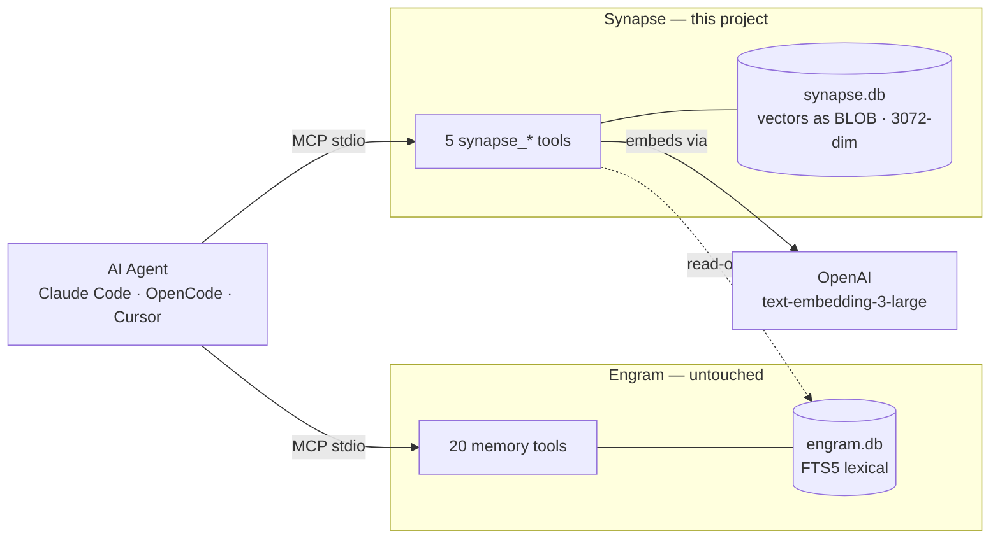

<div align="center">

# Synapse

**Semantic search for your [Engram](https://github.com/Gentleman-Programming/engram) memory — without touching Engram at all.**

[](LICENSE)
[](go.mod)
[](https://modelcontextprotocol.io)
[](go.mod)
[](#contributing)

<em>A synapse is the connection that gives meaning to a memory.</em>

</div>

---

## What is this?

[Engram](https://github.com/Gentleman-Programming/engram) gives your AI agent **persistent memory**, searched with SQLite **FTS5** — fast, lexical, keyword-based. But FTS5 only matches *words*, not *meaning*.

**Synapse** fixes that. It's a standalone MCP server that rides alongside Engram, reads its database **read-only**, and adds **semantic vector search** on top. Same memory, new sense — it finds memories by what they *mean*, even when they share **zero keywords** with your query:

| You search… | Synapse still finds… | Why plain FTS5 misses it |
|---|---|---|
| `the checkout is slow` | `Fixed N+1 query in the orders API` | no words in common |
| `auth keeps breaking` | `JWT tokens expire too early` | different vocabulary |
| `pago con tarjeta` 🇪🇸 | `Stripe payment integration` 🇬🇧 | different language |

<div align="center">

<br/>
<sub><b>Synapse is the oxpecker.</b> A small companion that rides on Engram's back and gives it the semantic vision it lacks — never getting in its way.</sub>
</div>

## Why it's built this way

- **Sibling, not wrapper.** Synapse exposes **new** `synapse_*` tools *next to* Engram's. It never intercepts or replaces `mem_search`. Run both; lose nothing.
- **Two databases, one owner each.** `engram.db` is read **read-only** and **never written**. Synapse owns a separate `synapse.db` for vectors. This isolation makes Synapse **immune to Engram's schema and version changes**.
- **Hybrid search.** Lexical (FTS5) + semantic (vector KNN) results fused with **Reciprocal Rank Fusion** (RRF, k=60) — you get exact keyword hits *and* meaning-based matches in one ranked list.
- **Self-healing.** Every `synapse_search` lazily vectorizes any new observations it touches and kicks a background backfill, so the index converges to 100% on its own. After the first run you never call `synapse_backfill` by hand.
- **Pure Go, zero CGO.** Vectors live in SQLite (via `modernc.org/sqlite`) and KNN is computed in Go — no C compiler, no build tags. A single `go build` cross-compiles to macOS, Linux and Windows, faithful to Engram's zero-dependency philosophy.

## Your data never leaves Engram

Synapse is an **index, not a store** — think Elasticsearch beside Postgres. Engram stays the single source of truth.

Synapse embeds your `title + content`, but `synapse.db` keeps **only the derived vector** per memory, plus a content hash, the model name, and the Engram `obs_id` that points back:

| Lives in `engram.db` (owned by Engram) | Lives in `synapse.db` (owned by Synapse) |
|---|---|
| title, content, type, project, timestamps, sessions, edits, deletes | `obs_id` → vector (BLOB) + content hash + model |

So Synapse **never holds your memories' text**. At search time it reads the title/snippet back from `engram.db` to build results. That means `synapse.db` is a **disposable cache**: delete it anytime and the next `synapse_backfill` (or search) rebuilds it from Engram — you can't lose a memory by touching Synapse.

## "Doesn't Engram's `--semantic` already do this?"

No — the names collide, but they solve different problems.

Engram's `conflicts --semantic` uses an **LLM to judge whether two memories contradict each other** (`conflicts_with`, `supersedes`, …) — it's **conflict detection**, and it only ever inspects pairs that **FTS5 already matched by shared keywords**. As Engram's own docs put it, it *"does not discover totally lexically unrelated pairs on its own."*

Synapse is **semantic search**: it ranks memories by **meaning** with vector embeddings, surfacing hits that share **no keywords** with your query — exactly the case a keyword-gated approach can't reach. Different problem, different mechanism; they compose cleanly, side by side.

## How it works



A `synapse_search` call runs FTS5 over `engram.db` and KNN over `synapse.db` in parallel, fuses the two ranked lists with RRF, and returns the merged result.

## Prerequisites

| Requirement | Why |
|---|---|
| **Go 1.25+** (only to build/install) | Build toolchain — no C compiler needed |
| **[Engram](https://github.com/Gentleman-Programming/engram) installed** | Synapse reads its `engram.db`; it complements Engram, it doesn't replace it |
| **An OpenAI API key** | Embeddings for vectorization and semantic search |

## Installation

Synapse is **pure Go** — no CGO, no C compiler, no build tags. The standard one-liner just works:

**Option A — install with Go (recommended):**

```sh
go install github.com/ediazs/synapse/cmd/synapse@latest
```

The binary lands in `$(go env GOPATH)/bin/synapse`. It cross-compiles cleanly, so prebuilt macOS / Linux / Windows binaries are also published on the [Releases](https://github.com/ediazs/synapse/releases) page — download and run, no toolchain required.

**Option B — build from source:**

```sh
git clone https://github.com/ediazs/synapse.git
cd synapse
cp .env.example .env      # then add your OPENAI_API_KEY
make build                # produces ./synapse
make test                 # run the suite
```

## Wiring it into your MCP client

Synapse runs **alongside** Engram. Keep your Engram server entry and add Synapse next to it.

**Claude Desktop / Claude Code / Cursor** (`claude_desktop_config.json` or `.mcp.json`):

```json
{
  "mcpServers": {
    "synapse": {
      "command": "/absolute/path/to/synapse",
      "env": {
        "OPENAI_API_KEY": "sk-...",
        "ENGRAM_DB_PATH": "/Users/you/.engram/engram.db"
      }
    }
  }
}
```

**OpenCode** (`opencode.json`):

```json
{
  "$schema": "https://opencode.ai/config.json",
  "mcp": {
    "synapse": {
      "type": "local",
      "command": ["/absolute/path/to/synapse"],
      "enabled": true,
      "environment": {
        "OPENAI_API_KEY": "sk-...",
        "ENGRAM_DB_PATH": "/Users/you/.engram/engram.db"
      }
    }
  }
}
```

Restart your client. You should now see the five `synapse_*` tools available next to Engram's.

## Configuration

Synapse reads configuration from the environment (a local `.env` is loaded automatically for development).

| Variable | Default | Description |
|---|---|---|
| `OPENAI_API_KEY` | — | **Required** for backfill and semantic search |
| `OPENAI_EMBED_MODEL` | `text-embedding-3-large` | Embedding model |
| `SYNAPSE_DB_PATH` | `~/.synapse/synapse.db` | Path to Synapse's vector DB |
| `ENGRAM_DB_PATH` | `~/.engram/engram.db` | Path to Engram's DB (read-only) |

## MCP Tools

| Tool | Description |
|---|---|
| `synapse_health` | Liveness + reachability of both databases |
| `synapse_stats` | Counts: live observations, vectors, orphans, dims, model |
| `synapse_backfill` | Idempotent batch-embed of un-vectorized observations ⚠️ *makes OpenAI API calls — see Costs* |
| `synapse_search` | Hybrid lexical + vector search (RRF), self-healing |
| `synapse_sync` | Detect and remove orphan vectors (observations deleted from Engram) |

## Using it after install

Once it's wired in, your agent sees the five `synapse_*` tools right next to Engram's. From then on:

```text
1. synapse_health    → (optional) sanity-check that both DBs are reachable
2. synapse_backfill  → run ONCE to vectorize the memories you already have
3. synapse_search    → the one you actually use — ask in natural language, any language
```

Step 2 is optional: search vectorizes on demand too, but a first backfill makes your very first searches complete. Your agent calls `synapse_search` whenever it needs to recall by meaning.

### Lazy, self-healing vectorization

You don't manage the index — **`synapse_search` keeps it current on its own.** Every call runs a two-speed cure:

- **Synchronous** — anything the search just matched (via FTS) that isn't vectorized yet is embedded **inline, before ranking**, so a memory saved seconds ago already shows up in semantic results in that *same* search.
- **Asynchronous** — a background, single-flighted backfill embeds whatever else has drifted, so the whole index reaches 100% for the next call. It's a no-op (and costs nothing) when there's nothing new.

> **How the trigger works:** this happens on **`synapse_search`** calls. Synapse is a *separate* MCP server, so it does **not** intercept Engram's own `mem_search` / `mem_context` — it can't see those. Whenever your agent reaches for semantic recall it calls `synapse_search`, and that call is what keeps the vectors fresh. No cron, no daemon, no manual step.

## Costs

`synapse_backfill` and `synapse_search` call the OpenAI embeddings API. `text-embedding-3-large` is billed per token. Vectorizing a few thousand observations is cheap (cents), but estimate before running on very large databases — see [OpenAI pricing](https://openai.com/api/pricing/). Want it free and local? Swapping in a local embedder (e.g. Ollama) is on the roadmap — the `Embedder` port is already abstracted for it.

## Smoke test (manual)

Requires a real `OPENAI_API_KEY` and a populated `~/.engram/engram.db`. Not part of the automated suite.

```sh
cp .env.example .env && $EDITOR .env      # fill in OPENAI_API_KEY
make build
echo '{"method":"tools/call","params":{"name":"synapse_backfill"}}' | ./synapse
echo '{"method":"tools/call","params":{"name":"synapse_search","arguments":{"query":"why is checkout slow"}}}' | ./synapse
```

## Architecture

Synapse follows **hexagonal architecture** — the domain is pure, infrastructure plugs into ports.

```text
cmd/synapse        composition root (wires everything, MCP stdio)
internal/
  domain           pure types + RRF fusion + content hashing (zero deps)
  port             interfaces: EngramReader, Embedder, VectorStore
  usecase          health · stats · backfill · search · sync
  engram           EngramReader adapter — reads engram.db read-only
  store            VectorStore adapter — pure-Go SQLite + cosine KNN over synapse.db
  embed            Embedder adapter — OpenAI (batched, retry+jitter)
  mcp              MCP tool handlers
```

Build and test are plain Go — no CGO, no tags:

```sh
make build   # CGO_ENABLED=0 go build -o synapse ./cmd/synapse
make test    # CGO_ENABLED=0 go test ./...
```

## Contributing

Issues and PRs are welcome. Before opening a PR: run `make test` (and ideally `go test -race ./...`). Keep the domain free of infrastructure imports, and cover new behavior with tests.

## Acknowledgments

- **[Engram](https://github.com/Gentleman-Programming/engram)** by Gentleman-Programming — the memory Synapse rides alongside.
- **[modernc.org/sqlite](https://pkg.go.dev/modernc.org/sqlite)** — the pure-Go SQLite that makes the zero-CGO build possible.
- **[Model Context Protocol](https://modelcontextprotocol.io)** — the protocol that makes it all composable.

## License

[MIT](LICENSE) © ediazs
